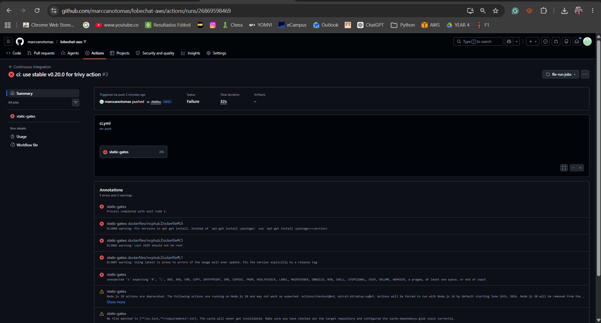

# DevOps — Practical Final Exam Report
**Engineer:** Marc Cano Tomàs  
**Repository:** [marccanotomas/lobechat-aws](https://github.com/marccanotomas/lobechat-aws)  

---

## CI Pipeline Execution Evidence

* **Actions Run URL:** https://github.com/marccanotomas/lobechat-aws/actions/runs/26869598469
* **Execution Commit SHA:** 4fe8fac

---

## Part A — Why What I Did Matters (Repository-Specific)

This build-free static-analysis pipeline provides a secure, lightweight validation layer that immediately catches critical architectural flaws and software supply chain vulnerabilities before any deployment activities take place. Below is the technical assessment of the risks mitigated by specific gates tailored to this repository:

### 1. Hadolint & Trivy Config Gates on `dockerfiles/mcphub.Dockerfile`
* **Line 1 (`FROM samanhappy/mcphub:latest`):** Mitigates the risk of **unpinned third-party base images**. If the upstream maintainer pushes a breaking update or a malicious layer to the `:latest` tag, our build process would automatically pull it, breaking reproducibility and injecting supply-chain vulnerabilities.
* **Line 5 (`USER root`):** Flags the risk of **privilege escalation**. Running the container processes as `root` violates the principle of least privilege. If an attacker exploits a vulnerability inside the `mcphub` application, they instantly gain root-level access to the host kernel filesystem.
* **Line 6 (`apt-get install -y docker.io gcc`):** Catches **unversioned package installations** into a runtime image. Without explicit pinning (e.g., `package=version`), `apt` fetches whatever is current in the Debian/Ubuntu mirrors at build time, leading to non-deterministic setups and introducing massive runtime blobs like `gcc` into production environments.

### 2. Hadolint Gate on `dockerfiles/sandbox.Dockerfile`
* **Third-party tool installations:** This file downloads binaries like `kubectl`, `eksctl`, and `zellij` directly from internet URLs using `curl` with no version pinning or cryptographic checksum verification (`sha256sum`). This exposes the infrastructure to Man-In-The-Middle (MITM) script injections. Additionally, granting **NOPASSWD sudo** access inside this sandbox container completely breaks runtime isolation boundaries.

### 3. Docker Compose Validation Gate (`docker compose config -q`)
* **Untagged and `:latest` images in `docker-compose.yml`:** The `lobe-chat` service lacks any image tag constraint, and both `qdrant:latest` and `minio:latest` use floating tags. This gate forces us to acknowledge that a direct deployment would pull mutable images, ruining environment parity across staging and production. 
* **TLS and Network Plaintext Exposures:** In `docker-compose.yml`, the Casdoor service links to Postgres using `sslmode=disable`, and Lobe-Chat's `DATABASE_URL` explicitly omits any TLS parameter. Secrets and application payloads are transmitted in plaintext across internal software boundaries.

### 4. Gitleaks Secret Scan Gate
* **Plaintext Environment Variables:** `docker-compose.yml` passes raw authentication placeholders and encryption tokens directly as environment variables. While `.gitignore` successfully isolates our real `.env` file, deployment manifests require automated secret scanning to guarantee that hardcoded production credentials never leak into git history.

### 5. Architectural Pipeline Decisions
* **Why the pipeline is build-free:** The 11-service stack relies on a heavy `vllm` (Vector LLM) engine that explicitly demands a specialized NVIDIA GPU and declares a massive `start_period: 300s`. GitHub-hosted runners lack GPU acceleration and would experience resource exhaustion or job timeouts trying to spin up this infrastructure.
* **Why `tests/` are excluded:** The code within `tests/test_vllm.py` imports `openai` and `httpx` to trigger actual HTTP health endpoints (`/health`). These are live-stack integration tests, not decoupled unit tests, and executing them requires a fully provisioned and seeded live backend environment.
* **Why the Compose interpolation fix is safe:** Executing `cp .env.example .env` inside the runner populates the environment block with safe placeholder variables. This satisfies the strict schema validation of `docker compose config` without exposing real production credentials, while `.gitignore` ensures that this generated `.env` file is never tracked or pushed.

---

## Part B — What is Missing for a Real Production CI/CD Pipeline

The workflow engineered in Deliverable 1 constitutes a strict **Continuous Integration** (CI) system focused exclusively on offline static security and quality gates. It acts as a quality filter but stops completely short of **Continuous Delivery or Continuous Deployment** (CD). To transition this system into a resilient, production-ready delivery machine, the following nine components must be implemented:

1. **Artifact Compilation, Signing, and SBOM Generation:** Rather than letting the target environment build raw files, the pipeline must compile `mcphub.Dockerfile` and `sandbox.Dockerfile`, push them to a private registry (such as AWS ECR), sign the images using tools like *Cosign*, and generate a Software Bill of Materials (SBOM) to enforce provenance.
2. **Resolution of Floating Tags to Immutable Digests:** The pipeline must intercept `docker-compose.yml` and programmatically map loose definitions like `qdrant:latest` or `lobe-chat` into immutable SHA256 image digests (e.g., `qdrant@sha256:...`) to guarantee exact code replication.
3. **Cryptographic Identity Federation via OIDC:** Instead of storing long-lived, high-risk static AWS keys (`AWS_ACCESS_KEY_ID` placeholders noted in `.env.example`), the CI runner must authenticate dynamically using GitHub Actions OpenID Connect (OIDC) to assume short-lived AWS IAM roles on the fly.
4. **Secure Production Secret Injection:** Secrets must never reside in text configurations or CI environment blocks. The CD pipeline must fetch tokens dynamically at deployment time from secure, managed infrastructure like AWS Systems Manager (SSM) Parameter Store or AWS Secrets Manager.
5. **Automated Database Migration Lifecycle:** Changes to the Postgres schema must be handled via a structured toolchain (`db/flyway` or `db/migrations`). The pipeline must run migration scripts automatically, while dangerous actions—such as the data-wiping `db/flyway/provision.sh clean` script—must be locked behind restrictive IAM permissions and manual gates.
6. **Staged Environment Promotion with Manual Approvals:** Code should move sequentially through an ordered pipeline flow (`dev` $\rightarrow$ `staging` $\rightarrow$ `production`). Transitioning to production must require explicit multi-engineer approval using GitHub Protected Environments.
7. **Secure Deployment Architecture (Reverse Proxy Isolation):** The actual deployment mechanism (utilizing AWS SSM Run Command or secure SSH to perform a `docker compose pull && docker compose up -d`) must execute inside an isolated VPC, keeping port `47000` closed to the public internet and routing traffic exclusively through a protected reverse proxy.
8. **Post-Deployment Smoke Testing & Health Synthetics:** The CD system must actively verify deployment success by running automated health checks against service endpoints, subsequently triggering the live integration test suite located in `tests/` against the newly deployed ephemeral stack.
9. **Automated Rollback and Configuration Baking:** Currently, the system injects operational code via a bind-mounted 3 MB monkeypatch (`patches/route.js` referenced at line 27 of `docker-compose.yml`). A real production pipeline must eliminate external mounts by baking patches directly into pinned custom container images, enabling instant, zero-downtime rollbacks if a smoke test fails.

### Strategic Prioritization

The **single highest-value next step** toward a true CD pipeline for this system is the **implementation of AWS Secrets Manager / SSM Parameter Store integration paired with GitHub OIDC Federation**. 

**Justification:** This addresses the most immediate operational vulnerability in the repository: the reliance on loose, plaintext credentials across `.env.example` and the dangerous exposure of mounting host `~/.aws` keys directly into the `mcphub` service configuration. Eliminating standing credentials and securing the configuration layer provides a baseline of zero-trust security that is mandatory before executing any automated infrastructure delivery.