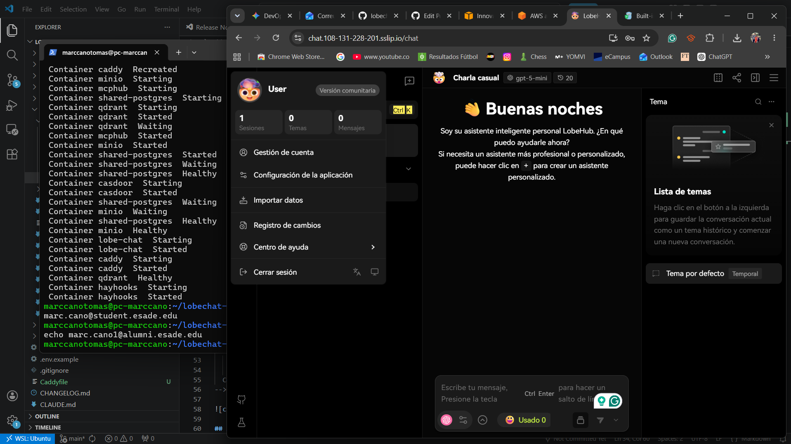
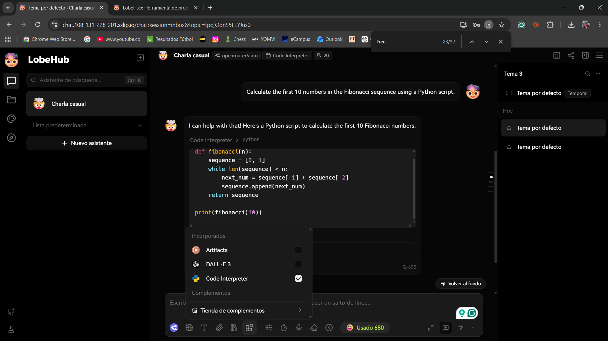

# Final Project — Evidence Report

## 1. Identity

| Field | Value |
|---|---|
| Student name | Marc Cano Tomàs |
| ESADE email | marc.cano@student.esade.edu |
| GitHub repo URL | https://github.com/marccanotomas/lobechat-aws |
| Latest commit SHA | 4779a9e24c89acaf49fee180f4972cb5b5d267e7 |
| Final tag | final-v1.0.0 |

## 2. Public URL

**[https://chat.108-131-228-201.sslip.io](https://chat.108-131-228-201.sslip.io)**

## 3. Screenshot — LobeChat over HTTPS, logged in



## 4. Screenshot — chat working (streaming + MCP)



## 5. Public reachability — `curl -sI https://<host>/`

```
curl.exe -sI https://chat.108-131-228-201.sslip.io/
HTTP/1.1 307 Temporary Redirect
Alt-Svc: h3=":443"; ma=2592000
Date: Mon, 01 Jun 2026 17:37:30 GMT
Location: /chat
Via: 1.1 Caddy
```

## 6. Negative test — port 47000 closed

```
curl.exe -v --max-time 5 http://108.131.228.201:47000/
*   Trying 108.131.228.201:47000...
* Connection timed out after 5011 milliseconds
* closing connection #0
curl: (28) Connection timed out after 5011 milliseconds
```

## 7. Stack runtime — `docker compose ps`

```
$ docker compose ps
NAME                IMAGE                             COMMAND                  SERVICE             STATUS              PORTS
caddy               caddy:2-alpine                    "caddy run --config …"   caddy               Up 4 hours          0.0.0.0:80->80/tcp, 0.0.0.0:443->443/tcp
casdoor             casbin/casdoor:latest             "/casdoor"               casdoor             Up 4 hours          8000/tcp
hayhooks            deepset/hayhooks:main             "hayhooks run --host…"   hayhooks            Up 4 hours          14149/tcp
lobe-chat           lobehub/lobe-chat                 "/node_modules/.bin/…"   lobe-chat           Up 4 hours (healthy) 3210/tcp
mcphub              lobehub/lobe-chat-mcp-hub         "docker-entrypoint.s…"   mcphub              Up 4 hours          3000/tcp
minio               minio/minio:latest                "/usr/bin/docker-ent…"   minio               Up 4 hours (healthy) 9000/tcp, 9001/tcp
qdrant              qdrant/qdrant:latest              "./qdrant"               qdrant              Up 4 hours (healthy) 6333/tcp
shared-postgres     postgres:16-alpine                "docker-entrypoint.s…"   shared-postgres     Up 4 hours (healthy) 5432/tcp
```