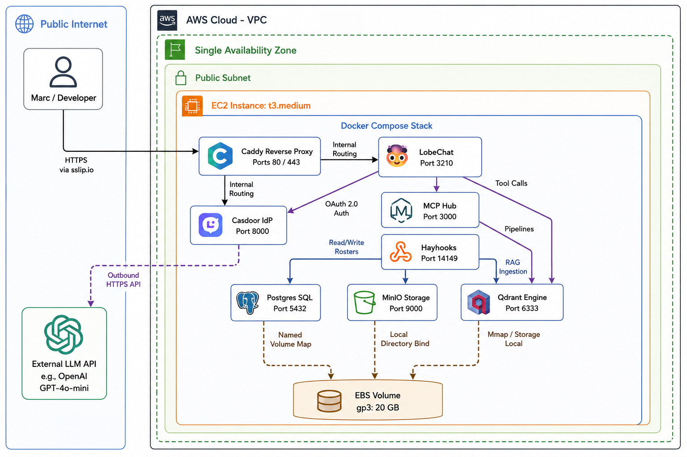
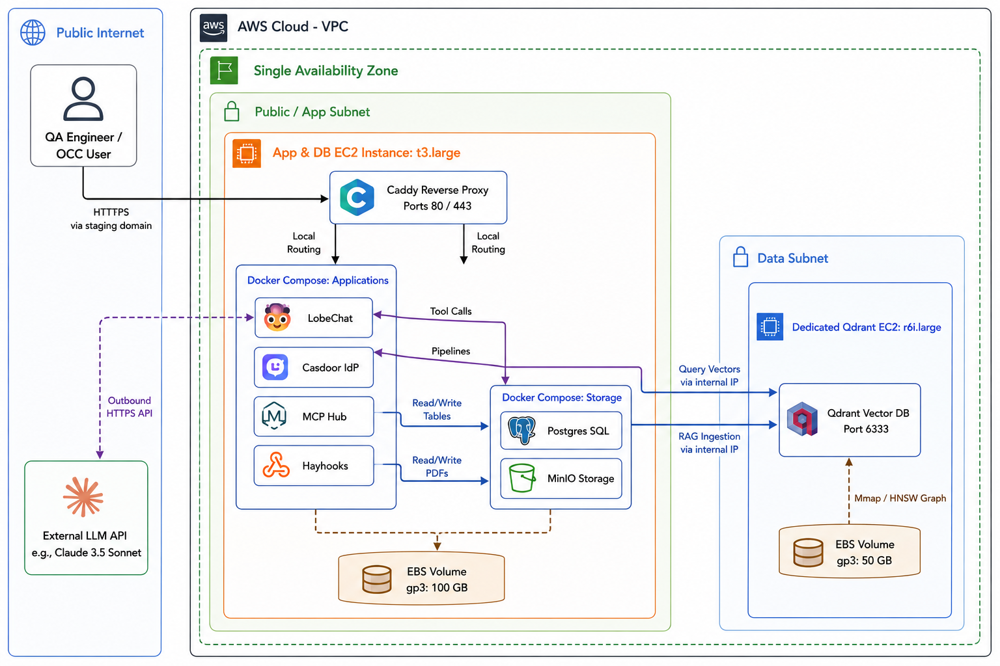
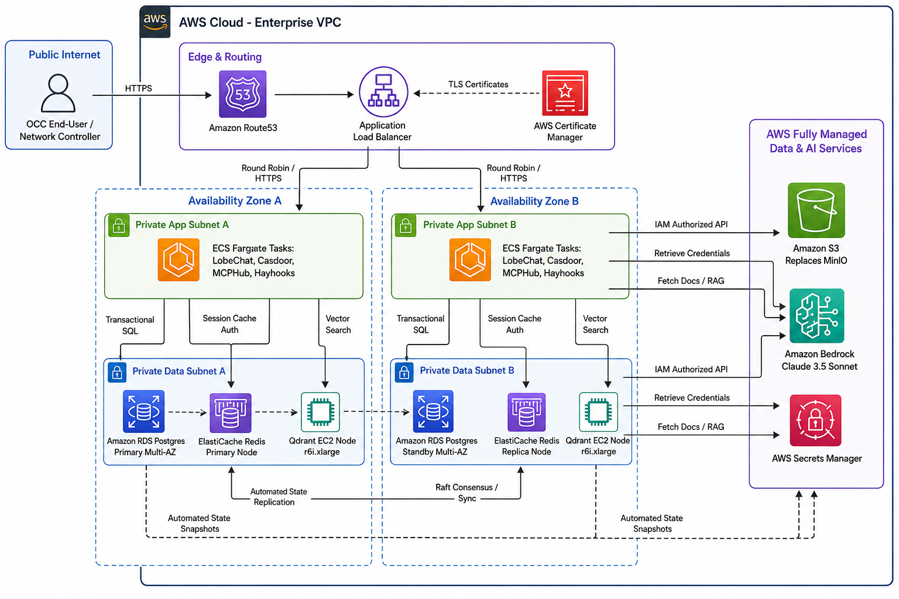

<!--
  Q2 — 3-environment architecture evolution.
  See docs/FINAL-PROJECT.md §3 Q2 for the full prompt and required sections.
  Length: 800–1500 words.

  Required sections (use as headings below):
    - Per-environment component table
    - Qdrant on EC2 — sizing, snapshots, recovery
    - AWS managed services in prod
    - Promotion flow
    - Data strategy
    - Trade-off table
    - Reverse-proxy / TLS choice
    - Architecture diagrams (3, one per env, under assets/)

  Replace this placeholder content. Remove these HTML comments before
  submission.
-->

# Q2 — 3-environment architecture evolution

## Per-environment component table

| Component | Development (Dev) | Staging (Stage) | Production (Prod) | Evolutionary Rationale |
| --- | --- | --- | --- | --- |
| **LobeChat** | Self-hosted Docker container on a shared single EC2 (`t3.medium`). | Docker container on a single dedicated EC2 (`t3.large`) to isolate resource testing. | AWS ECS Fargate tasks running behind an Application Load Balancer (ALB), scaled across 2 Availability Zones (AZs). | Dev/Stage prioritize low cost and simple local debugging. Prod requires high availability, automated horizontal scaling (CPU/Memory thresholds), and zero-downtime rolling updates. |
| **Casdoor** | Self-hosted Docker container on the same shared `t3.medium` instance. | Docker container on the staging EC2 (`t3.large`). | AWS ECS Fargate tasks scaled across 2 AZs, utilizing shared Redis for session caching. | Authentication must never become a single point of failure (SPOF). Production decouples the identity provider into an elastic container cluster. |
| **Postgres** | Containerized PostgreSQL with an EBS-backed named Docker volume. | Containerized PostgreSQL matching production engine versions exactly. | Amazon RDS PostgreSQL (`db.m6g.xlarge`) deployed in a Multi-AZ configuration. | Live crew rosters and flight schedules represent critical transactional state. Production offloads patching, automated multi-AZ replication, and point-in-time recovery to a fully managed service. |
| **MinIO / Storage** | Containerized MinIO mapping local folders for S3-compatible API access. | Containerized MinIO mapping local folders to replicate object storage patterns. | Native Amazon S3 buckets with server-side encryption (SSE-KMS) and Object Locking enabled. | MinIO provides a zero-cost local API testing ground for Dev/Stage. Production transitions natively to Amazon S3 to guarantee 99.999999999% data durability for critical legal PDF documents. |
| **Qdrant** | Containerized Qdrant running on an explicit EC2 instance (`t3.medium`). | Containerized Qdrant on a dedicated, memory-optimized EC2 instance (`r6i.large`). | High-performance Qdrant cluster on distributed EC2 instances (`r6i.xlarge`) utilizing raft consensus. | Hard constraint enforced across all environments to maintain granular command over vector indexes, memory-mapped files (mmap), and HNSW graph parameters. |
| **MCPHub** | Containerized node process on the shared Dev EC2 instance. | Containerized node process on Staging EC2. | AWS ECS Fargate task running as a sidecar container or decoupled microservice. | Connects LobeChat directly to private enterprise data targets. Production requires isolated container environments to prevent malicious tool execution from compromising the host network. |
| **Hayhooks** | Containerized Python app on the shared Dev EC2 instance. | Containerized Python app on Staging EC2. | AWS ECS Fargate tasks with an independent target group behind the ALB. | Handles semantic pipeline processing. Production scales instances independently based on incoming API throughput from OCC user actions. |
| **LLM Provider** | External API endpoints utilizing low-cost models (e.g., GPT-4o-mini). | External API endpoints testing full-scale models (e.g., Claude 3.5 Sonnet / GPT-4o). | Amazon Bedrock endpoints accessing Claude 3.5 Sonnet under a dedicated provisioned throughput tier. | Production shifts to Amazon Bedrock to enforce zero-data-retention compliance mandates, ensuring sensitive aviation crew schedules and PII are never utilized for public model training. |

## Qdrant on EC2 — sizing, snapshots, recovery

Retaining Qdrant on self-managed **EC2** infrastructure across all deployment tiers enables the airline to bypass the steep cost-premiums of managed vector databases while retaining bare-metal control over the underlying memory allocations—a critical factor when performing dense **HNSW** vector queries under tight 30-minute **OCC** turnaround windows.

## Resource Sizing & Storage Justification

Development: Deployed on a single t3.medium instance (2 vCPUs, 4 GiB **RAM**) backed by a 20 GiB gp3 **EBS** volume. This scale accommodates small, tokenized subsets of **EASA** documentation and mock collective labor agreements.

Staging: Upgraded to an r6i.large instance (2 vCPUs, 16 GiB **RAM**) backed by a 50 GiB gp3 **EBS** volume. The memory-optimized instance family is introduced here to accurately simulate production index build times and vector distribution shapes.

Production: Scaled to an r6i.xlarge instance cluster (4 vCPUs, 32 GiB **RAM**) utilizing a **200** GiB gp3 **EBS** volume configured with a baseline performance of 3,**000** **IOPS** and **125** MB/s throughput. This setup guarantees that the entire vector index of **EASA** regulations, localized union agreements, and historical flight delay case logs can be locked entirely into volatile memory, achieving sub-100ms conversational search latencies.

## Snapshot and Backup Policy

State preservation is decoupled from the compute instance via **AWS** Data Lifecycle Manager (**DLM**):

Production: Automated **EBS** snapshots are executed every hour for incremental data state capture, with a strict 14-day rolling retention window. Furthermore, native Qdrant snapshot **API** binaries are invoked via a cron utility every 6 hours, pushing highly compressed vector state files directly to an encrypted S3 cold storage tier.

Staging & Development: **DLM** captures daily snapshots for Staging (retained for 3 days) and weekly snapshots for Development, minimizing unnecessary **AWS** infrastructure spending.

## Instance Recovery and High Availability

To recover gracefully from underlying **AWS** hypervisor or hardware degradations without losing state, an Amazon CloudWatch alarm is bound to the Qdrant **EC2** instance tracking the StatusCheckFailed_System metric.

Upon breach, an **AWS** **EC2** Auto-Recovery action is automatically initialized. This workflow stops the degraded instance, provisions an identical hardware replacement within the same Availability Zone, and re-attaches the existing gp3 **EBS** volume containing the localized vector indices. The instance preserves its private and Elastic IP allocations, preventing any routing topology breakdowns within the internal **MCP** configuration.

## AWS managed services in prod

Production shifts from self-contained Docker volumes to a resilient cloud architecture by embedding four core AWS managed services:
1. **Amazon RDS PostgreSQL (Multi-AZ)**  
   Replaces the containerized PostgreSQL database. By utilizing synchronous replication across a primary and secondary Availability Zone, RDS automatically executes a failover routing shift if the primary database host goes offline. It natively secures the highly confidential crew roster information, processing continuous automated backups and encrypted transaction logs.

2. **Amazon S3 (Simple Storage Service)**  
   Eliminates the need to maintain an active MinIO container footprint in production. Amazon S3 natively handles the heavy object storage payloads of raw EASA aviation legislation, historical delays, and contract PDFs. Durability is structurally guaranteed up to 99.999999999% and is backed by Cross-Region Replication (CRR) to a secondary geographical destination for disaster recovery compliance.

3. **AWS Secrets Manager**  
   Centralizes the encryption, lifecycle rotation, and delivery of production credentials, database connection parameters, and Amazon Bedrock security keys. This service replaces static local `.env` storage configurations, injecting variables dynamically into ECS Fargate task definitions at launch time via AWS IAM role authorizations.

4. **Application Load Balancer (ALB) paired with AWS Certificate Manager (ACM)**  
   Acts as the public-facing edge for the OCC system. ACM handles the automatic generation and annual renewal of the corporate domain's wildcard TLS certificate. The ALB terminates public TLS traffic at the edge, actively scrubbed by AWS Shield Standard for DDoS mitigation, and distributes traffic downstream across the healthy elastic container pools.

## Promotion flow

Infrastructure mutations and application updates are managed through a deterministic, environment-progressive pipeline driven by GitHub Actions and AWS CodePipeline.

1. **Branching Strategy and Code Management**  
   The codebase adheres to a strict GitFlow branching model:
   - **feature/\***: Transient branches dedicated to singular engineering changes, branching exclusively from `dev`.
   - **dev**: The core integration channel representing the continuous state of the Development environment.
   - **staging**: Pre-production validation environment. Merges into `staging` occur only via Pull Requests originating from `dev`.
   - **main**: The definitive production-state channel. Only tags pointing to this branch are executed on live enterprise infrastructure.

2. **Tagging Convention**  
   Artifact generation uses explicit Semantic Versioning structures:
   - Commits passing unit tests on the `dev` branch generate ephemeral tags: `vX.Y.Z-dev.build+sha`.
   - Promotion to Staging creates a Release Candidate tag: `vX.Y.Z-rc[N]`.
   - Final production sign-off strips the pre-release markers, applying a definitive, immutable structural tag: `final-vX.Y.Z` (e.g., `final-v1.0.0`).

3. **Pipeline Deployment Gates and Approvals**  
   - **Dev Gate (Fully Automated):** Any code merge into the `dev` branch triggers a linting suite, security vulnerability container scanning, and an automated deployment execution to the shared Dev EC2 host.
   - **Stage Gate (Semi-Automated):** Merging into `staging` requires a Pull Request showing a clean pass of all unit tests, plus a mandatory peer-review approval from at least one Senior DevOps Engineer. Once merged, the pipeline builds stable Docker images, pushes them to Amazon Elastic Container Registry (ECR), and restarts the Staging environment containers.
   - **Prod Gate (Fully Gated):** Promotion from `staging` to `main` requires explicit production logs proving successful integration testing, accompanied by administrative sign-off in GitHub Actions by both the Lead Systems Architect and the OCC Product Owner (acting as the Change Advisory Board). Deployment to ECS Fargate uses an automated rolling-update strategy, ensuring zero-downtime service execution.

## Data strategy

To maintain total compliance with European GDPR laws and avoid exposing operational secrets, data must be degraded or enhanced based on the environment tier.
1. **Development: Realistic-but-Safe Data**  
   Developers must never interface with real crew addresses, phone numbers, or active financial payload data. The Development PostgreSQL and Qdrant databases are populated via an automated data generation utility using Python's Faker and FactoryBoy frameworks. This process builds structurally valid relational tables—matching real flight constraints and route patterns—while populating records with completely synthetic passenger names, scrambled employee identifiers, and artificial crew rosters.

2. **Staging: Production Synthesis Mirroring**  
   Staging must evaluate complex queries against edge cases that synthetic generation tools cannot easily predict. To achieve this safely, an automated data sanitation pipeline is executed weekly.
   - An Amazon RDS snapshot of the Production database is created.
   - The snapshot is isolated within a secure sandbox environment.
   - An AWS Lambda obfuscation function removes or transforms sensitive data:
     - Names are converted to cryptographic hashes.
     - Dates of birth are generalized.
     - Personal contact information is replaced with inactive placeholder domains.
   - The sanitized dataset is restored into the Staging RDS instance while preserving the operational integrity of the records.

3. **Production: Backup and Restoration Architecture**  
   Production data strategy enforces a zero-data-loss architecture across all storage models:
   - **Relational Data (RDS):** Automated daily backups are retained for 30 days. Continuous transaction log streams enable Point-in-Time Recovery (PITR) with a recovery granularity of up to 5 minutes, mitigating accidental deletions and ransomware-related incidents.
   - **Vector State (Qdrant on EC2):** Internal Qdrant collections are frozen and serialized into state snapshots every hour. These snapshots are stored in an Amazon S3 bucket protected with Object Lock in Compliance Mode, preventing deletion even by administrative users during the retention period.
   - **Restoration Drill:** Every quarter, an automated recovery process creates a detached verification environment from backups to validate that the Mean Time to Recover (MTTR) remains below the corporate target of 60 minutes.

## Trade-off table

| Environment | Reliability | Cost | Operational Complexity | Strategic Architectural Trade-off Justification |
|------------|-------------|------|-------------------------|------------------------------------------------|
| **Development** | Low (2/5) | Minimal (5/5) | Low (5/5) | **Velocity over Resiliency:** Everything runs inside a single, low-cost EC2 instance using basic Docker Compose. Hardware failure causes temporary downtime for developers, but saves thousands in monthly infrastructure overheads. No HA or complex routing is engineered here. |
| **Staging** | Medium (3/5) | Medium (3/5) | Medium (3/5) | **Accuracy over Economy:** Individual services are separated onto dedicated EC2 hosts to prevent resource starvation false-positives. It mirrors production API structures closely enough to guarantee valid QA testing, but drops multi-AZ infrastructure replication models to balance budgetary parameters. |
| **Production** | High (5/5) | High (1/5) | High (1/5) | **Resiliency over Cost:** Every single application component is decoupled into highly available, multi-AZ elastic clusters (ECS Fargate and RDS Multi-AZ). Cost is sacrificed completely to ensure that the OCC platform remains online during regional infrastructure failures, directly avoiding catastrophic flight grounding expenses. |

## Reverse-proxy / TLS choice

1. **Dev and Stage: Caddy Reverse Proxy**  
   For the Development and Staging EC2 environments, Caddy is chosen as the definitive reverse proxy wrapper. Because these early environments operate with ephemeral public testing domains (such as dynamic `sslip.io` endpoints or rapid staging instances), Caddy’s embedded ACME protocol engine handles automated Let's Encrypt or ZeroSSL TLS certificate acquisition and renewal instantly at runtime without external dependencies.

   It manages internal routing rules, directing port traffic neatly downstream into LobeChat, Casdoor, and Hayhooks containers using a clean, easily maintainable `Caddyfile` that developers can audit directly in the repository source code.

2. **Production: AWS Application Load Balancer (ALB) and ACM**  
   In the Production environment, Caddy is replaced at the outer edge by an AWS Application Load Balancer (ALB) paired with AWS Certificate Manager (ACM).

   Maintaining a containerized proxy in front of an enterprise-scale elastic production stack introduces an unnecessary management bottleneck and an infrastructure Single Point of Failure (SPOF). The ALB delivers native, cloud-scale hardware routing that scales automatically to handle sudden spikes in operational user traffic during severe weather disruptions. ACM manages enterprise corporate security certificates natively, offloading the cryptographic processing overhead entirely from downstream ECS Fargate application containers.

## Architecture diagrams

